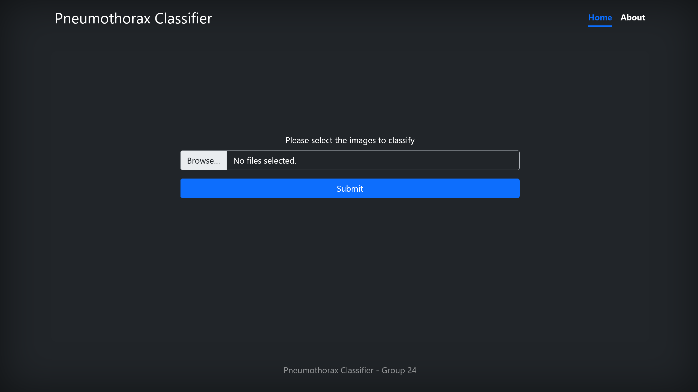
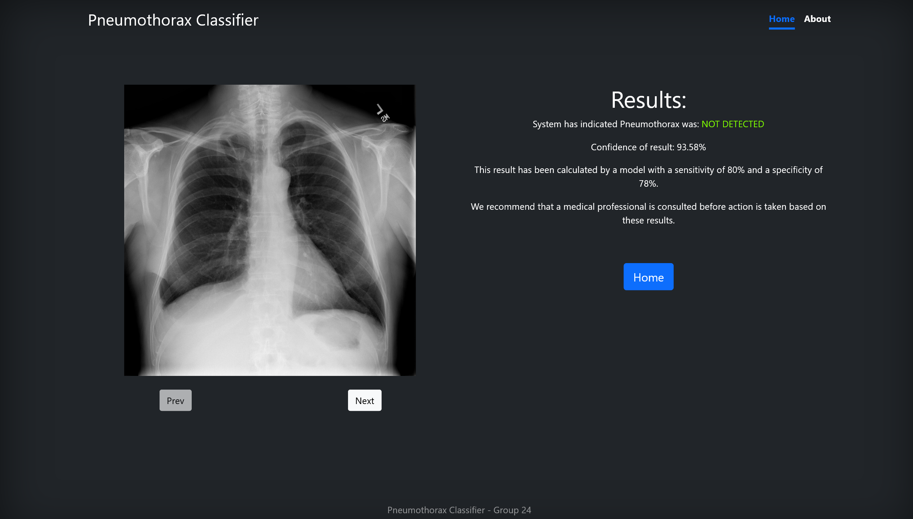
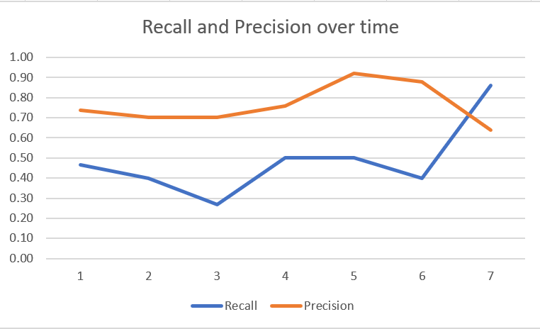
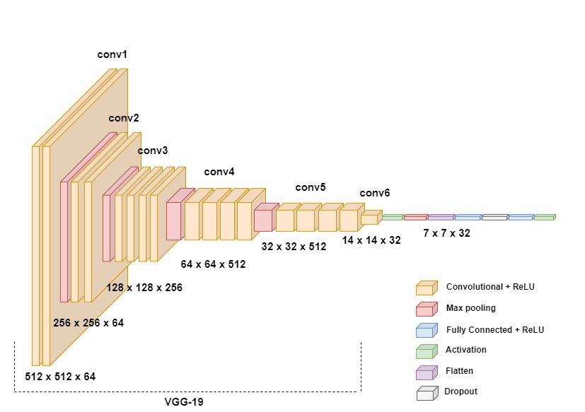
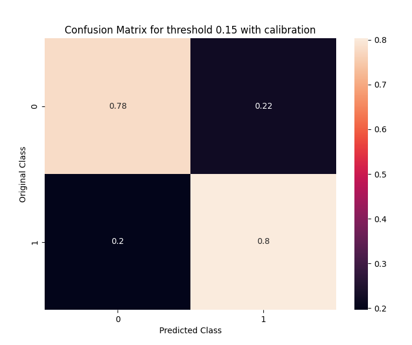

# Pneumothorax Classifier

A machine learning application to classify chest X-rays for detecting pneumothorax, developed during Trinity College Dublin's Software Engineering Project module, with mentorship from engineers at Microsoft.

Pneumothorax is a serious medical condition where air leaks into the space between the lung and the chest wall. Diagnosis of the condition is currently performed through the use of a chest X-ray, a difficult process requiring specialist expertise to perform and interpret. Due to the fact that pneumothorax can be life threatening, a fast, accurate diagnosis is desirable, though often wait times can be long due to the workload on staff, or in lesser developed locations staff may not be available at all.

After speaking with staff at Midland Regional Hospital Tullamore, it became clear to Microsoft, our client and mentors, that interpreting the X-rays to give a diagnosis would be a good candidate for automation, potentially allowing for faster and more accurate diagnoses.

# Front end UI
The front end web interface was created using HTML, JS, CSS and the Bootstrap 5 framework.
Multiple images can be uploaded and the results displayed to the end user so a diagnosis can be made.

Primary objective of design was to create a clean, accessible interface. As a key goal of this project was to save medical professionals time, we opted to keep the user interface quite simple.

The user interface is available at [pneumothorax.mawh.in](https://pneumothorax.mawh.in/)

## Screenshots
### Homepage Screenshot

### Results Screenshot

# ML Model

## Dataset
We used a variant of the SIIM-ACR Pneumothorax Segmentation Dataset: https://www.kaggle.com/vbookshelf/pneumothorax-chest-xray-images-and-masks

A further change we made to the dataset was separating the training and test data into sub-folders as well as removing the masks since we did not need them for our classification. This allowed us to more easily use the dataset in our training script.

### Dataset Statistics
Number of files: 12047  
| # Training Images | 10675 |
|-------------------|-------|
| Positive          | 2379  |
| Negative          | 8296  |

| # Testing Images | 1372 |
|------------------|------|
| Positive         | 290  |
| Negative         | 1082 |

## Model Results
These are the results of using different base models

| # Name                                               | # Loss | # Accuracy | # Recall          | # Precision |
|------------------------------------------------------|--------|------------|-------------------|-------------|
| VGG contrast, zoom, translation and fine tuning      |        |            | 0.8151            | 0.89        |
| VGG No Augmentation Fine Tuning                      | 0.3922 | 0.8393     | 0.6512            | 0.608       |
| VGG with augmentation                                | 0.4554 | 0.7902     | 0? (not sure why) | 0           |
| VGG no augmentation                                  | 0.3866 | 0.84       | 0.3936            | 0.7167      |
| VGG with augmentation and fine tuning                | 0.3629 | 0.84       | 0.4036            | 0.7019      |
| VGG with trans, zoom and fine tuning                 | 0.3752 | 0.8608     | 0.5               | 0.7592      |
| VGG with trans, zoom, fine tuning and extra training | 0.4118 | 0.8520     | 0.5655            | 0.6805      |
| EfficientNet with augmentation                       | 1.1644 | 0.7909     | N/A               | N/A         |
| EfficientNet no augmentation                         | 0.509  | 0.8229     | N/A               | N/A         |

# Final Model

We selected VGG-19 as a base model using it for feature extraction, before building our own classification layers on top.

This model allows for an 80% sensitivity and 78% specificity:

# Infrastructure
The ML related infrastructure is hosted in Azure using Azure's Machine Learning Service, while the user interface is deployed to GitHub pages. Deployments are automated using GitHub Actions so that when changes are made to the model or user interface, they are reflected in production.

## Architecture Diagram

# Authors
 - [Cian Mawhinney](https://github.com/cianmawhinney)
 - [Dermot O'Brien](https://github.com/mangledbottles)
 - [Emmet McDonald](https://github.com/EmmetMcD)
 - [Kenneth Harmon](https://github.com/KennethHarmon)
 - [Elliot Lyons](https://github.com/elliot-lyons)
 - [Jacob Sharpe](https://github.com/j-wilsons)
 - [Aj Pakulyte](https://github.com/pakulyta)
