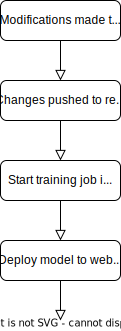

# Infrastructure

The infrastructure is hosted in Azure, using ML Studio. Deployments are to be automated with GitHub actions so that when the code for the model is modified, the model is re-trained and deployed to a Web Endpoint.

## Deployment Diagram

